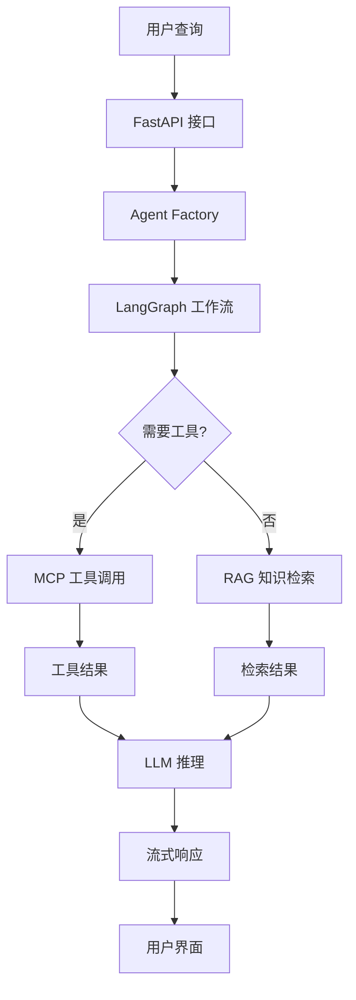

# RAG-Agent 项目快速上手指南

> 🎯 **目标读者**: 希望快速理解和上手 RAG-Agent 项目的开发者
> 
> 📅 **更新时间**: 2025年8月
> 
> 🔗 **项目类型**: 智能对话代理系统，集成高级RAG检索和动态MCP工具调用

## 📋 项目概览

### 🎯 核心价值
RAG-Agent 是一个**生产就绪**的智能对话代理系统，具备以下核心能力：

- **🧠 智能推理**: 基于 LangGraph 的 ReAct 模式，支持思考-行动循环
- **📚 知识检索**: 高级 RAG 系统，支持向量检索、查询优化、结果重排序
- **🛠️ 动态工具**: 创新的 MCP (Model Context Protocol) 工具集成，支持热插拔
- **🌐 Web API**: FastAPI 后端，提供完整的 RESTful API 服务
- **⚡ 高性能**: 全异步架构，支持流式响应和并发处理

### 🏗️ 技术栈

| 组件 | 技术选型 | 作用 |
|------|----------|------|
| **AI框架** | LangGraph + LangChain | Agent 工作流编排 |
| **LLM** | DeepSeek | 核心推理引擎 |
| **Embedding** | Qwen | 文本向量化 |
| **向量数据库** | ChromaDB | RAG 知识检索 |
| **工具协议** | MCP (Model Context Protocol) | 动态工具集成 |
| **Web框架** | FastAPI | RESTful API 服务 |
| **通信方式** | stdio + SSE | 本地进程通信 + 流式响应 |

## 🚀 快速启动

### 1. 环境准备

```bash
# 克隆项目
git clone https://github.com/xyt662/Agent.git
cd Agent

# 安装依赖
pip install -r requirements.txt

# 配置环境变量
cp .env.example .env
# 编辑 .env 文件，添加必要的 API 密钥
```

### 2. 启动服务

```bash
# 启动后端 API 服务
python start_api.py
# 服务地址: http://localhost:8000
# API 文档: http://localhost:8000/docs
```

### 3. 测试验证

```bash
# 运行测试套件
python test_api_client.py

# 或直接测试
python run.py
```

## 🏛️ 架构设计

### 核心设计哲学

项目采用**依赖注入 + 工厂模式**的架构，实现了完美的关注点分离：

```
📁 graphs/     → 定义工作流"蓝图"（结构）
📁 nodes/      → 实现具体业务逻辑（节点）
📁 tools/      → 提供工具能力（零件）
📁 core/       → 核心基础组件（引擎）
📁 factories/  → 组装所有组件（总装车间）
```

### 数据流向



## 🧩 核心组件详解

### 1. Agent 工作流 (`graphs/`)

**文件**: `src/rag_agent/graphs/base_agent_graph.py`

```python
class BaseAgentGraphBuilder:
    """ReAct Agent 图构建器"""
    
    def build(self, llm, tools):
        # 1. 创建 Agent 节点（思考）
        # 2. 创建 Tool 节点（行动）
        # 3. 定义路由逻辑
        # 4. 编译成可执行图
```

**工作流程**:
1. **思考阶段**: Agent 分析用户查询，决定下一步行动
2. **行动阶段**: 调用工具或检索知识库
3. **循环迭代**: 根据结果继续思考或结束对话

### 2. MCP 工具系统 (`tools/`)

**核心创新**: 基于 stdio 的本地 MCP 工具集成

#### 工具配置 (`tools.config.json`)
```json
{
  "mcpServers": {
    "tavily_mcp": {
      "command": "npx",
      "args": ["-y", "tavily-mcp@0.2.1"],
      "env": {"TAVILY_API_KEY": "${TAVILY_API_KEY}"},
      "disabled": false
    },
    "baidu_map": {
      "command": "npx",
      "args": ["-y", "@baidumap/mcp-server-baidu-map"],
      "env": {"BAIDU_MAP_API_KEY": "${BAIDU_MAP_API_KEY}"},
      "disabled": false
    }
  }
}
```

#### 工具调用流程
```python
# 1. 启动 MCP 服务器进程
process = subprocess.Popen(["npx", "-y", "tavily-mcp@0.2.1"])

# 2. 通过 stdio 建立通信
stdio_transport = await stdio_client(server_params)

# 3. 发送 JSON-RPC 请求
result = await session.call_tool("search", {"query": "Python"})

# 4. 获取结果并返回
return result.content
```

**技术优势**:
- ⚡ **高性能**: stdio 通信，延迟 ~1ms vs HTTP ~50-200ms
- 🔧 **即插即用**: `npx -y package-name` 自动下载运行
- 🔄 **热重载**: 运行时更新配置，无需重启服务
- 🛡️ **安全隔离**: 进程级别隔离，无网络攻击面

### 3. RAG 检索系统 (`retrieval/`)

**文件**: `src/rag_agent/retrieval/pipeline.py`

#### 检索管道
```python
class RetrievalPipeline:
    def invoke(self, query: str) -> List[Document]:
        # 1. 查询转换和优化
        enhanced_query = self.query_transformer.transform(query)
        
        # 2. 向量检索
        docs = self.base_retriever.retrieve(enhanced_query)
        
        # 3. 结果重排序
        reranked_docs = self.reranker.rerank(query, docs)
        
        return reranked_docs
```

**检索流程**:
1. **查询优化**: 扩展关键词，优化检索效果
2. **向量检索**: 基于 ChromaDB 的语义检索
3. **结果重排**: 使用重排序模型优化相关性
4. **去重过滤**: 移除重复和低质量结果

### 4. Web API 服务 (`main.py`)

**核心端点**:

```python
# 流式聊天
POST /chat/invoke
{
  "session_id": "session-123",
  "query": "从杭州到西安怎么走？"
}

# 工具热重载
POST /tools/reload

# 会话管理
GET /chat/sessions/{session_id}/history
DELETE /chat/sessions/{session_id}
```

**流式响应格式**:
```json
// Agent 开始
event: agent_start
data: {"session_id": "session-123", "query": "..."}

// 工具调用
event: tool_start
data: {"tool_name": "map_directions", "tool_input": {...}}

// LLM 生成
event: llm_chunk
data: {"chunk": "从杭州到西安"}

// Agent 结束
event: agent_end
data: {"session_id": "session-123", "final_answer_length": 150}
```

## 🎮 使用示例

### 1. 基础对话

```python
# 启动 Agent
from src.rag_agent.factories.agent_factory import get_main_agent_runnable

app = await get_main_agent_runnable()

# 发起对话
inputs = {"messages": [HumanMessage(content="你好，介绍一下自己")]}

async for state in app.astream(inputs):
    print(state)
```

### 2. 工具调用示例

```python
# 地图导航
query = "从杭州到西安怎么走？"
# → 自动调用 baidu_map 工具

# 网络搜索
query = "最新的AI技术发展"
# → 自动调用 tavily_mcp 搜索工具

# 知识问答
query = "LangGraph的核心优势是什么？"
# → 自动调用 RAG 检索系统
```

### 3. API 调用示例

```python
import httpx

# 流式聊天
async with httpx.AsyncClient() as client:
    async with client.stream(
        "POST", 
        "http://localhost:8000/chat/invoke",
        json={"session_id": "test", "query": "你好"}
    ) as response:
        async for line in response.aiter_lines():
            if line.startswith("data: "):
                data = json.loads(line[6:])
                print(data)
```

## 🔧 开发指南

### 添加新的 MCP 工具

1. **更新配置文件**:
```json
// tools.config.json
{
  "mcpServers": {
    "my_tool": {
      "command": "npx",
      "args": ["-y", "my-mcp-package@1.0.0"],
      "env": {"API_KEY": "${MY_API_KEY}"},
      "disabled": false
    }
  }
}
```

2. **热重载工具**:
```bash
curl -X POST http://localhost:8000/tools/reload
```

### 扩展 RAG 检索

1. **添加新的数据源**:
```python
# 将文档放入 data/raw/ 目录
# 运行向量化脚本
python tools/scripts/build_vectorstore.py
```

2. **自定义检索策略**:
```python
# 继承 RetrievalPipeline
class CustomRetrievalPipeline(RetrievalPipeline):
    def invoke(self, query: str) -> List[Document]:
        # 自定义检索逻辑
        pass
```

### 添加新的 Agent 节点

```python
# src/rag_agent/nodes/my_node.py
def my_custom_node(state: AgentState) -> AgentState:
    """自定义节点逻辑"""
    # 处理状态
    return state

# 在图中注册节点
graph.add_node("my_node", my_custom_node)
```

## 🧪 测试和调试

### 运行测试

```bash
# 完整测试套件
python run_tests.py all

# 单元测试
python run_tests.py unit

# 集成测试
python run_tests.py integration

# MCP 工具测试
python tests/test_mcp_tools_simple.py
```

### 调试技巧

1. **查看日志**:
```python
import logging
logging.basicConfig(level=logging.DEBUG)
```

2. **检查工具状态**:
```bash
# 查看已加载的工具
curl http://localhost:8000/tools/status
```

3. **监控进程**:
```bash
# 查看 MCP 进程
ps aux | grep npx
```

## 📊 性能优化

### 关键指标

- **响应延迟**: < 2秒（包含工具调用）
- **并发支持**: 100+ 并发会话
- **内存使用**: < 1GB（包含向量数据库）
- **工具启动**: < 500ms（stdio 通信）

### 优化建议

1. **缓存策略**:
   - Agent 实例缓存
   - 工具连接复用
   - 检索结果缓存

2. **异步优化**:
   - 全异步 I/O
   - 并发工具调用
   - 流式响应

3. **资源管理**:
   - 自动进程清理
   - 内存监控
   - 连接池管理

## 🚀 部署指南

### Docker 部署

```dockerfile
FROM python:3.11-slim

# 安装 Node.js（用于 MCP 工具）
RUN apt-get update && apt-get install -y nodejs npm

# 复制项目文件
COPY . /app
WORKDIR /app

# 安装依赖
RUN pip install -r requirements.txt

# 启动服务
CMD ["python", "start_api.py"]
```

### 生产环境配置

```bash
# 使用 Gunicorn + Uvicorn
gunicorn src.rag_agent.main:app \
  -w 4 \
  -k uvicorn.workers.UvicornWorker \
  --bind 0.0.0.0:8000
```

## 🔮 未来规划

### 第一阶段：增强功能
- [ ] 多跳查询分解
- [ ] 主动澄清机制
- [ ] 自我纠错能力

### 第二阶段：高级特性
- [ ] 动态工具生成
- [ ] 长期记忆系统
- [ ] 多 Agent 协作

### 第三阶段：企业级
- [ ] 自主学习优化
- [ ] 分布式部署
- [ ] 监控告警系统

## 📚 参考资源

- **LangGraph 文档**: https://langchain-ai.github.io/langgraph/
- **MCP 协议**: https://modelcontextprotocol.io/
- **FastAPI 文档**: https://fastapi.tiangolo.com/
- **ChromaDB 文档**: https://docs.trychroma.com/

## 🤝 贡献指南

1. **代码规范**: 遵循 PEP 8
2. **测试覆盖**: 新功能需要测试
3. **文档更新**: 重要变更需要更新文档
4. **性能测试**: 关键路径需要性能测试

---

> 💡 **提示**: 这个项目展示了现代 AI Agent 系统的最佳实践，特别是在工具集成和架构设计方面。通过学习这个项目，您可以掌握构建生产级 AI 应用的核心技术。

> 🎯 **快速上手**: 建议先运行 `python run.py` 体验基本功能，然后查看 `test_api_client.py` 了解 API 使用方式，最后通过 FastAPI 接口体验完整的服务功能。