# SynapseAgent 技术架构深度解析

## 📋 项目概述

**SynapseAgent** 是一个基于 LangGraph 构建的高级检索增强生成（RAG）代理系统，采用现代化的模块化架构设计，集成了 MCP（Model Context Protocol）工具生态，实现了智能化的多模态任务处理能力

### 核心特性
- 🏗️ **模块化架构**：基于依赖注入和关注点分离的设计原则
- 🔄 **ReAct工作流**：实现 Reason-Act 循环的智能决策机制
- 🛠️ **MCP工具集成**：支持本地MCP服务器的动态工具调用
- 📚 **RAG检索系统**：多层次的文档检索和重排序机制
- ⚡ **异步优先**：全异步的工具调用和生命周期管理

---

## 🏛️ 整体架构设计

### 架构层次图

```
┌─────────────────────────────────────────────────────────────┐
│                    应用层 (Application Layer)                │
├─────────────────────────────────────────────────────────────┤
│  FastAPI Server  │  CLI Interface  │  Test Runners         │
├─────────────────────────────────────────────────────────────┤
│                    工厂层 (Factory Layer)                   │
├─────────────────────────────────────────────────────────────┤
│  Agent Factory   │  Dependency Injection  │  Caching       │
├─────────────────────────────────────────────────────────────┤
│                    图层 (Graph Layer)                       │
├─────────────────────────────────────────────────────────────┤
│  LangGraph       │  State Management     │  Flow Control   │
├─────────────────────────────────────────────────────────────┤
│                    节点层 (Node Layer)                      │
├─────────────────────────────────────────────────────────────┤
│  Agent Node      │  Tool Node           │  Routing Logic   │
├─────────────────────────────────────────────────────────────┤
│                    工具层 (Tool Layer)                      │
├─────────────────────────────────────────────────────────────┤
│  MCP Tools        │  MCP Adapter       │  Tool Registry  │
├─────────────────────────────────────────────────────────────┤
│                    核心层 (Core Layer)                      │
├─────────────────────────────────────────────────────────────┤
│  LLM Provider    │  Config Management    │  State Definition│
└─────────────────────────────────────────────────────────────┘
```

### 核心设计原则

#### 1. 依赖注入 (Dependency Injection)
- **工厂模式**：通过 `AgentFactory` 统一管理组件的创建和装配
- **接口抽象**：各组件通过接口解耦，便于测试和替换
- **配置驱动**：通过配置文件动态注入依赖关系

#### 2. 关注点分离 (Separation of Concerns)
- **图定义与实现分离**：`graphs/` 目录只定义结构，不包含具体实现
- **业务逻辑与基础设施分离**：核心业务逻辑与工具、配置等基础设施解耦
- **状态管理统一化**：通过 `AgentState` 统一管理所有状态信息

---

## 🧩 核心组件详解

### 1. 状态管理系统

#### AgentState 设计
```python
class AgentState(TypedDict):
    """现代化的Agent状态,只通过messages驱动一切"""
    messages: Annotated[List[BaseMessage], operator.add]
```

**设计亮点**：
- **简化状态结构**：遵循现代 LangGraph 最佳实践，只保留 `messages` 字段
- **类型安全**：使用 `TypedDict` 确保类型安全
- **自动聚合**：通过 `operator.add` 实现消息的自动追加

### 2. 工厂模式实现

#### Agent Factory 架构
```python
async def get_main_agent_runnable() -> Callable:
    """工厂函数,负责组装和编译主Agent"""
    # 1. 获取工具签名用于缓存key
    # 2. 检查缓存是否命中
    # 3. 如果缓存未命中，则构建新的Agent实例
    # 4. 返回Agent实例
```

**核心职责**：
- **零件获取**：调用 `llm_provider` 获取LLM，调用 `tool_registry` 获取工具
- **蓝图选择**：从 `graphs` 目录导入图模板
- **组装编译**：将具体组件注入图模板并编译
- **缓存管理**：通过 LRU 缓存提高性能

### 3. LangGraph 工作流引擎

#### ReAct 工作流设计
```python
def should_continue(state: AgentState) -> str:
    """路由逻辑：检查最新的消息是否包含工具调用"""
    if state['messages'][-1].tool_calls:
        return "action"
    return "end"
```

**工作流程**：
1. **Agent Node**：LLM 分析输入，决定是否需要调用工具
2. **Conditional Edge**：基于 LLM 输出决定下一步行动
3. **Tool Node**：执行具体的工具调用
4. **循环执行**：直到任务完成或达到最大迭代次数

### 4. MCP 工具集成系统

#### 本地命令适配器
```python
class LocalCommandToolAdapter:
    """本地命令MCP适配器类
    
    负责启动本地MCP服务器子进程并与其通信
    将MCP工具转换为LangChain工具
    """
```

**技术实现**：
- **Stdio 通信**：通过标准输入输出与 MCP 服务器通信
- **异步管理**：使用 `AsyncExitStack` 管理资源生命周期
- **动态工具生成**：运行时动态创建 LangChain 工具包装器
- **环境变量注入**：自动解析和注入 API 密钥

#### 工具包管理器
```python
class ToolPackageManager:
    """工具包管理器"""
    
    def __init__(self, project_root: Optional[Path] = None):
        # 配置加载和工具包解析
```

**核心功能**：
- **配置解析**：支持官方 `mcpServers` 格式和自定义格式
- **环境变量解析**：动态解析 `${VAR_NAME}` 格式的环境变量
- **生命周期管理**：自动管理 MCP 服务器子进程
- **热重载支持**：支持配置文件的热重载

### 5. RAG 检索系统

#### 检索管道架构
```python
class RetrievalPipeline:
    """检索管道
    
    职责：
    - 编排完整的检索流程
    - 管理各个检索组件
    - 提供可配置的检索策略
    - 处理异常和回退机制
    """
```

**检索流程**：
1. **查询转换**：通过 `QueryTransformer` 优化查询
2. **向量检索**：使用 `VectorDBRetriever` 进行相似度搜索
3. **文档去重**：移除重复的检索结果
4. **重排序**：通过 `DocumentReranker` 优化结果排序
5. **缓存机制**：避免重复检索提高性能

---

## 🛠️ 技术栈分析

### 核心框架

| 组件 | 技术选型 | 版本要求 | 作用 |
|------|----------|----------|------|
| **LangChain** | langchain-core | >=0.1.0 | 基础框架和工具抽象 |
| **LangGraph** | langgraph | >=0.1.0 | 工作流编排和状态管理 |
| **MCP** | mcp | >=1.0.0 | 工具协议和客户端 |
| **FastAPI** | fastapi | >=0.104.0 | Web API 服务 |
| **ChromaDB** | chromadb | >=0.4.0 | 向量数据库 |

### 语言模型支持

| 提供商 | 集成方式 | 配置方式 |
|--------|----------|----------|
| **DeepSeek** | langchain-deepseek | 环境变量 `DEEPSEEK_API_KEY` |
| **Qwen** | langchain_community | 环境变量 `DASHSCOPE_API_KEY` |

### 工具生态

| 工具类型 | 实现方式 | 配置文件 |
|----------|----------|----------|
| **百度地图** | MCP Server (npm) | tools.config.json |
| **Tavily搜索** | MCP Server (npm) | tools.config.json |
| **知识库检索** | 内置工具 | 代码配置 |

---

## ⚙️ 配置管理系统

### 配置文件层次

```
配置管理
├── .env                    # 环境变量和API密钥
├── tools.config.json       # MCP工具配置
└── 代码配置               # 硬编码的默认配置
```

### MCP 工具配置示例
```json
{
  "mcpServers": {
    "tavily_mcp": {
      "command": "npx",
      "args": ["-y", "tavily-mcp@0.2.1"],
      "env": {
        "TAVILY_API_KEY": "${TAVILY_API_KEY}"
      },
      "disabled": false
    }
  }
}
```

**配置特性**：
- **环境变量插值**：支持 `${VAR_NAME}` 格式的变量替换
- **热重载**：支持运行时配置更新
- **向后兼容**：同时支持官方格式和自定义格式

---

## 🔄 工作流程详解

### 1. Agent 初始化流程

```mermaid
sequenceDiagram
    participant U as User
    participant F as AgentFactory
    participant TM as ToolManager
    participant G as GraphBuilder
    participant L as LLMProvider
    
    U->>F: get_main_agent_runnable()
    F->>TM: 初始化工具管理器
    TM->>TM: 加载配置文件
    TM->>TM: 启动MCP服务器
    F->>L: 获取LLM实例
    F->>G: 创建图构建器
    G->>G: 定义节点和边
    F->>F: 编译最终应用
    F->>U: 返回可运行应用
```



### 2. 查询处理流程

```mermaid
flowchart TD
    A[用户输入] --> B[Agent Node]
    B --> C{需要工具调用?}
    C -->|是| D[Tool Node]
    C -->|否| E[直接回答]
    D --> F[执行工具]
    F --> G[工具结果]
    G --> B
    E --> H[返回结果]
```



### 3. MCP 工具调用流程

```mermaid
sequenceDiagram
    participant A as Agent
    participant TN as ToolNode
    participant MCP as MCPAdapter
    participant S as MCPServer
    
    A->>TN: 调用工具
    TN->>MCP: 转发调用
    MCP->>S: stdio通信
    S->>S: 执行工具逻辑
    S->>MCP: 返回结果
    MCP->>TN: 包装结果
    TN->>A: 返回工具消息
```



---

## 🎯 性能优化策略

### 1. 缓存机制

#### Agent 实例缓存
```python
_agent_cache = {}

def _get_cache_key(tools_signature: str, llm_model: str) -> str:
    return f"{tools_signature}_{llm_model}"
```

#### 检索结果缓存
```python
class RetrievalPipeline:
    def __init__(self):
        self._cache: Dict[str, List[Document]] = {}
        self._enable_cache = self.config.get('enable_cache', False)
```

### 2. 异步优化

- **全异步架构**：所有 I/O 操作都使用异步实现
- **并发工具调用**：支持多个工具的并发执行
- **资源池管理**：复用 MCP 连接和 LLM 实例

### 3. 内存管理

- **状态简化**：只保留必要的 `messages` 状态
- **工具缓存**：避免重复加载工具定义
- **连接复用**：复用 MCP 服务器连接

---

## 🧪 测试架构

### 测试层次结构

```
tests/
├── unit/                   # 单元测试
│   └── test_tool_manager.py
├── integration/            # 集成测试
│   └── test_tool_manager_integration.py
├── test_api_client.py      # API客户端测试
├── test_baidu_api_key.py   # 百度API密钥测试
├── test_baidu_map_tools.py # 百度地图工具测试
├── test_both_endpoints.py  # 双端点测试
├── test_mcp_direct.py      # MCP直接调用测试
└── test_mcp_tools_simple.py # MCP工具简单测试
```

### 测试策略

- **单元测试**：测试单个组件的功能
- **集成测试**：测试组件间的协作
- **端到端测试**：测试完整的用户场景
- **工具测试**：验证 MCP 工具的可用性

---


## 🔮 技术演进路线

### 已实现功能
- ✅ 基础 ReAct 工作流
- ✅ MCP 工具集成
- ✅ RAG 检索系统
- ✅ 工厂模式架构
- ✅ 异步优化

### 规划中功能
- 🔄 多跳查询分解
- 🔄 自我纠错机制
- 🔄 主动澄清功能
- 🔄 错误处理节点
- 🔄 更多工具集成

### 技术债务
- 📝 完善文档覆盖
- 🧪 增加测试覆盖率
- 🔧 性能监控和指标
- 🛡️ 安全性加固

